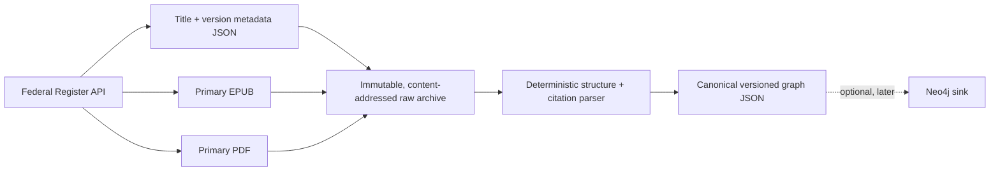

# Migration Law Knowledge Graph — Foundation

## 1. Vision — what we are building

We are building a reproducible, point-in-time knowledge graph of Australian
migration legislation. It should answer a legal-structure question with evidence:
for a visa subclass, which validity item, grant criteria, public-interest criteria,
conditions, provisions and legislative-instrument hooks apply **in a nominated
version of the law**.

The product of ingestion is not a summary and is not legal advice. It is a
source-linked canonical representation of legislation that downstream research,
review and visualisation tools can query. Every asserted fact remains traceable to
an immutable Register response or document, exact source location and parser rule.

The Phase 1 boundary is deliberately narrow: the Migration Act 1958, Migration
Regulations 1994 and registered migration legislative instruments from the Federal
Register of Legislation API. A full historical corpus is a sequence of versioned
snapshots, never a single overwritten “current law” graph.

### Acceptance slice

Subclass 102 (Adoption) proves the initial model. The graph must reconstruct:

1. Schedule 1 item 1108, `Child (Migrant) (Class AH)`, as its validity pathway;
2. Schedule 2 Subclass 102's grant provisions;
3. express references, including Public Interest Criteria (PICs), provisions and
   visa conditions where present; and
4. hooks to instruments specified for forms, place/manner or countries.

## 2. Ontology

All legal content entities are version-scoped. A stable title may have many
versions; a provision node is a version-specific expression of a provision. This
prevents later compilations from silently changing a historical answer.

| Entity | Stable identity / purpose |
| --- | --- |
| `LegislationTitle` | A Register title, keyed by `title_id` (for example `F1996B03551`). |
| `LegislationVersion` | A point-in-time title view, keyed by title + Register version ID. Retains compilation and effective intervals. |
| `Schedule`, `Part`, `Division`, `Subdivision` | Version-specific structural containers. |
| `Provision` | A numbered section, regulation, clause or Schedule 1 item in a particular version. |
| `VisaClass` | A Schedule 1 visa class, such as `Child (Migrant) (Class AH)`. |
| `VisaSubclass` | A Schedule 2 subclass, such as `102 — Adoption`. |
| `PIC` | A Public Interest Criterion identified by number, version-scoped where described or applied. |
| `SRC` | A Special Return Criterion, handled analogously to a PIC. |
| `VisaCondition` | A numbered visa condition. |
| `LegislativeInstrument` | A registered instrument; may initially be an unresolved, source-backed hook until its title is ingested. |

### Provenance contract

Every node and every relationship has this provenance object:

```json
{
  "source_title_id": "F1996B03551",
  "source_version_id": "F2026C00667",
  "source_document": "F2026C00667.epub",
  "source_location": "OEBPS/document_2/document_2.html#p-123",
  "source_text": "the exact extracted text",
  "effective_from": "2026-07-01T00:00:00",
  "effective_to": null,
  "retrieved_at": "2026-08-08T12:00:00Z",
  "source_hash": "sha256 digest",
  "parser_version": "0.1.0",
  "extraction_method": "epub-html-structure-v1",
  "confidence": 1.0
}
```

`effective_from`/`effective_to` are legal-version facts. Register `status`,
`isCurrent`, `isLatest`, and unincorporated-amendment flags are retained as source
metadata but do not replace them. In particular, Register “in force” can include
legislation made but not yet commenced.

## 3. Relationships

| Relationship | From → to | Meaning in Phase 1 |
| --- | --- | --- |
| `HAS_VERSION` | Title → Version | A point-in-time expression belongs to a title. |
| `CONTAINS` | Version/container → container/provision | Structural membership in the source document. |
| `PART_OF` | Child structure → parent structure | Reverse-friendly structural context. |
| `HAS_SUBCLASS` | VisaClass → VisaSubclass | A Schedule 1 visa class makes that subclass available. |
| `HAS_VALIDITY_PROVISION` | VisaSubclass → Schedule 1 item | The subclass's application-validity item. |
| `HAS_GRANT_PROVISION` | VisaSubclass → Schedule 2 provision | A criterion/circumstance/condition provision in its grant pathway. |
| `REFERENCES` | Provision → provision/title | Explicit generic citation retained even if unresolved. |
| `REFERENCES_PIC` / `REFERENCES_SRC` / `REFERENCES_CONDITION` | Provision → criterion/condition | Typed references discovered deterministically. |
| `AUTHORISED_BY` | Instrument/Regulations → enabling title | Register or source authority. |
| `SPECIFIED_BY` | Provision/item → LegislativeInstrument | A source-backed instrument hook; initially may be unresolved. |
| `AMENDED_BY` | Version/title → amending title | Register version reason metadata. |
| `SUPERSEDED_BY` | Earlier version → later version | Adjacent known versions only; it does not imply an effective date. |

Relationship direction is intentional for query ergonomics; its provenance records
the exact text that supports it. The initial parser emits only relationships it can
support deterministically. It does not infer substantive legal consequences.

## 4. Source architecture



The API client calls the documented `Titles`, `versions/find`, and
`documents/find` routes. It does not scrape Register pages. For each selected
version it archives:

- exact title and version API JSON envelopes;
- the primary EPUB (the parser source);
- every available primary PDF volume (visual/authorised evidence where published);
- a manifest of request URLs, retrieval moments, filenames, MIME types and hashes.

The archive is content-addressed below `raw/<title id>/<version id>/<sha256>/`.
Different source bytes never overwrite one another. Reprocessing uses the archived
EPUB; it therefore does not need the network or a mutable source page.

## 5. Update strategy

1. Poll selected title metadata and the title's current Register version on a
   bounded schedule. Phase 1 begins with the Act and Regulations, then discovered
   registered migration instruments.
2. Compare Register version ID and document metadata with the latest archived
   version. If unchanged, record nothing new.
3. If new or rectified, archive new API JSON and each published EPUB/PDF object
   before parsing. Never replace a prior object.
4. Build the new version graph independently. Link it to its title with
   `HAS_VERSION`; add `SUPERSEDED_BY` only between known adjacent versions.
5. Preserve `hasUnincorporatedAmendments`, version reasons and future/status
   metadata. An amendment is not treated as operative merely because it is
   registered or listed “in force”.
6. Run deterministic regression tests, beginning with Subclass 102, then publish
   the graph output. A future Neo4j upsert consumes this output without changing
   archival or parsing.

The runnable local equivalent of that loop is `scripts/daily_ingestion.py`. It is
the artifact to place in a future scheduled container/job; its persistent
`data/raw` path must then be mapped to durable object storage or a durable volume.

### Instrument discovery boundary

The Register does not expose an authority-filtered title list in the documented
API surface used by this MVP. The initial deterministic discovery query selects
in-force, principal `LegislativeInstrument` titles with names beginning
`Migration`. This avoids unrelated uses of the word “migration” while keeping
selection transparent and reproducible. Instrument hooks extracted from the
Regulations remain explicit unresolved nodes unless a matching registered title is
ingested; they are never guessed.

This strategy favours completeness and reproducibility over premature incremental
diffing. Once version ingestion is reliable, document-level hashes can avoid
unnecessary re-parsing without weakening the archive.
